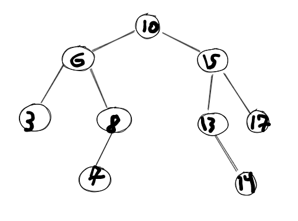

# Elabore um algoritmo recursivo para efetuar uma busca em uma árvore binária de busca pressupondo as estruturas de dados do exemplo anterior

## Desenho da árvore fornecida como exemplo

No arquivo exportExampleTree.js, criou-se uma BST de exemplo simples e exportou-se o nó de raíz.

No 2.js, temos um algoritmo recursivo que busca por um valor, recebendo o valor e uma raíz como exemplo.

Ele começa verificando se ele recebeu null como argumento no lugar do nó. Se recebeu, retorna nulo (considera-se que o valor não foi encotrado na árvore).

Em seguida, se o valor do nó atual é o valor desejado, retorna o nó.

Se for maior, retorne uma chamada recursiva passando o filho esquerdo do nó atual.

Se for menor, retorne uma chamada recursiva passando o filho direito do nó atual.

No final do arquivo, tem-se exemplos do algoritmo funcionando.
